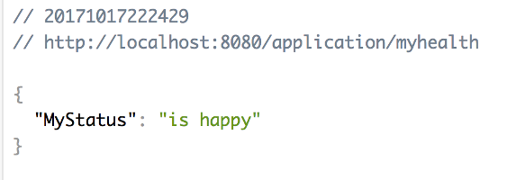

[![Build Status][travis-badge]][travis-badge-url]
[![Quality Gate][sonarqube-badge]][sonarqube-badge-url] 
[![Technical debt ratio][technical-debt-ratio-badge]][technical-debt-ratio-badge-url] 
[![Coverage][coverage-badge]][coverage-badge-url]


Spring Boot 2.0 Actuator Examples
=======================================

[Spring Actuator](https://spring.io/blog/2017/08/22/introducing-actuator-endpoints-in-spring-boot-2-0) 
with [Spring Boot 2.0](https://docs.spring.io/spring-boot/docs/current-SNAPSHOT/reference/htmlsingle/#production-ready-endpoints-custom) examples.

- Example of a Spring Boot 2.0 custom Actuator endpoint

### Build
Execute the following command from the parent directory to build the jar file:
```
mvn clean install
```

### Run
From the parent directory, executte the following coommand to start the application:
```
java -jar target/spring-actuator-example-1.0.0.jar
```

You should notice the application starting up,
```
  .   ____          _            __ _ _
 /\\ / ___'_ __ _ _(_)_ __  __ _ \ \ \ \
( ( )\___ | '_ | '_| | '_ \/ _` | \ \ \ \
 \\/  ___)| |_)| | | | | || (_| |  ) ) ) )
  '  |____| .__|_| |_|_| |_\__, | / / / /
 =========|_|==============|___/=/_/_/_/
 :: Spring Boot ::        (v2.0.0.RELEASE)

...
completed in 1799 ms
...
2018-03-16 19:42:53.256  INFO 61043 --- [           main] s.w.s.m.m.a.RequestMappingHandlerMapping : Mapped "{[/error],produces=[text/html]}" onto public org.springframework.web.servlet.ModelAndView org.springframework.boot.autoconfigure.web.servlet.error.BasicErrorController.errorHtml(javax.servlet.http.HttpServletRequest,javax.servlet.http.HttpServletResponse)
2018-03-16 19:42:53.346  INFO 61043 --- [           main] s.b.a.e.w.s.WebMvcEndpointHandlerMapping : Mapped "{[/myhealth],methods=[GET],produces=[application/vnd.spring-boot.actuator.v2+json || application/json]}" onto public java.lang.Object org.springframework.boot.actuate.endpoint.web.servlet.AbstractWebMvcEndpointHandlerMapping$OperationHandler.handle(javax.servlet.http.HttpServletRequest,java.util.Map<java.lang.String, java.lang.String>)
...
43 --- [           main] o.s.j.e.a.AnnotationMBeanExporter        : Registering beans for JMX exposure on startup
2018-03-16 19:42:53.967  INFO 61043 --- [           main] o.s.c.support.DefaultLifecycleProcessor  : Starting beans in phase 2147483647
2018-03-16 19:42:53.968  INFO 61043 --- [           main] d.s.w.p.DocumentationPluginsBootstrapper : Context refreshed
2018-03-16 19:42:53.982  INFO 61043 --- [           main] d.s.w.p.DocumentationPluginsBootstrapper : Found 1 custom documentation plugin(s)
2018-03-16 19:42:54.010  INFO 61043 --- [           main] s.d.s.w.s.ApiListingReferenceScanner     : Scanning for api listing references
2018-03-16 19:42:54.127  INFO 61043 --- [           main] o.s.b.w.embedded.tomcat.TomcatWebServer  : Tomcat started on port(s): 8080 (http) with context path ''
2018-03-16 19:42:54.132  INFO 61043 --- [           main] com.basaki.Application                   : Started Application in 4.452 seconds (JVM running for 5.266)

```

Once the application starts up, navigate to `http://localhost:8080/myhealth` in a browser, e.g., Chrome.
You should notice `myhealth` information as shown below,




[travis-badge]: https://travis-ci.org/indrabasak/spring-actuator-example.svg?branch=master
[travis-badge-url]: https://travis-ci.org/indrabasak/spring-actuator-example/

[sonarqube-badge]: https://sonarcloud.io/api/project_badges/measure?project=com.basaki%3Aspring-actuator-example&metric=alert_status
[sonarqube-badge-url]: https://sonarcloud.io/dashboard/index/com.basaki:spring-actuator-example

[technical-debt-ratio-badge]: https://sonarcloud.io/api/project_badges/measure?project=com.basaki%3Aspring-actuator-example&metric=sqale_index
[technical-debt-ratio-badge-url]: https://sonarcloud.io/dashboard/index/com.basaki:spring-actuator-example 

[coverage-badge]: https://sonarcloud.io/api/project_badges/measure?project=com.basaki%3Aspring-actuator-example&metric=coverage
[coverage-badge-url]: https://sonarcloud.io/dashboard/index/com.basaki:spring-actuator-example
