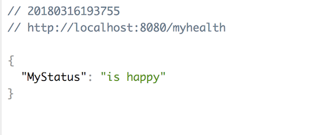

[![Build Status][travis-badge]][travis-badge-url]


Spring Boot 2.0 Actuator Examples
=======================================

[Spring Actuator](https://spring.io/blog/2017/08/22/introducing-actuator-endpoints-in-spring-boot-2-0) 
with [Spring Boot 2.0](https://docs.spring.io/spring-boot/docs/2.0.0.M5/reference/htmlsingle/) examples.

- Example of a Spring Boot 2.0 custom Actuator endpoint

### Build
Execute the following command from the parent directory to build the jar file:
```
mvn clean install
```

### Run
From the parent directory, executte the following coommand to start the application:
```
java -jar target/spring-actuator-example-1.0.0.jar
```

You should notice the application starting up,
```

  .   ____          _            __ _ _
 /\\ / ___'_ __ _ _(_)_ __  __ _ \ \ \ \
( ( )\___ | '_ | '_| | '_ \/ _` | \ \ \ \
 \\/  ___)| |_)| | | | | || (_| |  ) ) ) )
  '  |____| .__|_| |_|_| |_\__, | / / / /
 =========|_|==============|___/=/_/_/_/
 :: Spring Boot ::             (v2.0.0.M5)

2017-10-17 22:24:19.762  INFO 22844 --- [           main] com.basaki.Application                   : Starting Application on jdoe-1234.local with PID 22844 (/Users/john.doe/Development/examples/spring-actuator-example/target/spring-actuator-example-1.0.0.jar started by indra.basak in /Users/john.doe/Development/examples/spring-actuator-example)

...
2017-10-17 22:24:24.168  INFO 22844 --- [           main] s.d.s.w.s.ApiListingReferenceScanner     : Scanning for api listing references
2017-10-17 22:24:24.369  INFO 22844 --- [           main] o.s.b.w.embedded.tomcat.TomcatWebServer  : Tomcat started on port(s): 8080 (http)
2017-10-17 22:24:24.374  INFO 22844 --- [           main] com.basaki.Application                   : Started Application in 5.172 seconds (JVM running for 5.616)
2017-10-17 22:24:29.016  INFO 22844 --- [nio-8080-exec-1] o.a.c.c.C.[Tomcat].[localhost].[/]       : Initializing Spring FrameworkServlet 'dispatcherServlet'
2017-10-17 22:24:29.016  INFO 22844 --- [nio-8080-exec-1] o.s.web.servlet.DispatcherServlet        : FrameworkServlet 'dispatcherServlet': initialization started
2017-10-17 22:24:29.033  INFO 22844 --- [nio-8080-exec-1] o.s.web.servlet.DispatcherServlet        : FrameworkServlet 'dispatcherServlet': initialization completed in 17 ms

```

Once the application starts up, navigate to `http://localhost:8080/application/myhealth` in a browser, e.g., Chrome.
You should notice `myhealth` information as shown below,




[travis-badge]: https://travis-ci.org/indrabasak/spring-actuator-example.svg?branch=master
[travis-badge-url]: https://travis-ci.org/indrabasak/spring-actuator-example/